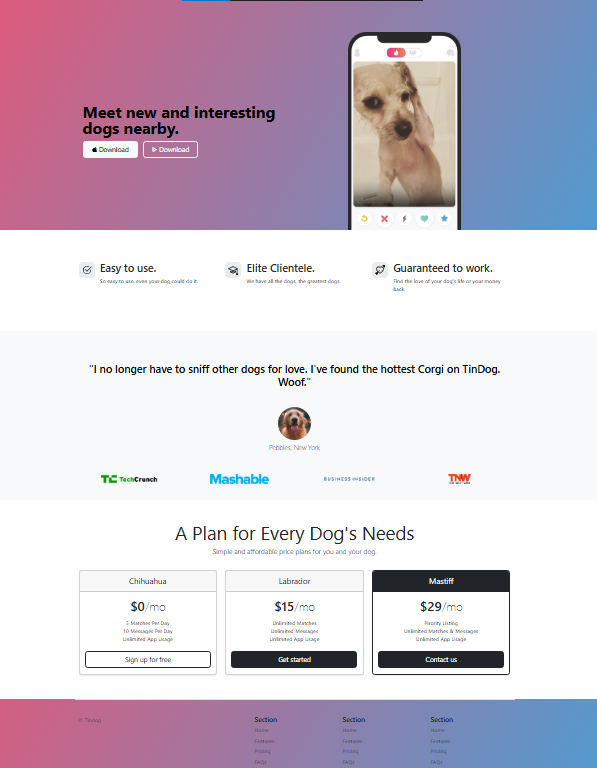

# 🐶 TinDog - Bootstrap Landing Page for Dog Dating App

TinDog is a fun and modern landing page concept for a fictional dog-dating mobile app.  
This project was built as part of the [Dr. Angela Yu Web Development Bootcamp] to practice advanced layout techniques with **Bootstrap 5.3**, including pricing sections, testimonials, and feature highlights.

---

## ✨ Features

- 🐕‍🦺 **Hero Section** with mobile device mockup and call-to-action buttons  
- ⭐ **Features Grid** explaining core benefits  
- 🗣️ **Testimonial Section** with dog quote and press logos  
- 💳 **Responsive Pricing Cards** with three flexible plans  
- 📱 Clean and modern **mobile-first responsive layout**  
- 🎨 Custom styling via external CSS (`solution.css`)

---

## 📷 Screenshot



> 💡 Replace `screenshot.png` with your own preview image of the homepage.

---

## 🚀 Technologies Used

- HTML5  
- CSS3  
- Bootstrap 5.3 CDN  
- Custom external stylesheet (`/css/solution.css`)  
- Icons from Bootstrap Icons  
- Images stored in local `/images` directory

---

## 📁 Project Structure

```
index.html
/css/
  └── solution.css
/images/
  ├── iphone.png
  ├── dog-img.jpg
  ├── techcrunch.png
  ├── mashable.png
  ├── bizinsider.png
  ├── tnw.png
  └── screenshot.png
```

---

## 🛠️ How to Run Locally

1. Clone the repository:
   ```bash
   git clone https://github.com/yourusername/tindog-bootstrap.git
   cd tindog-bootstrap
   ```

2. Open `index.html` in your browser:
   ```bash
   open index.html
   ```
   أو ببساطة افتح الملف في المتصفح مباشرة.

---

## 🧠 Lessons Learned

This project allowed me to:
- Apply responsive layouts using Bootstrap’s grid system
- Build component-based sections: testimonials, pricing cards, and feature rows
- Manage assets and apply external custom CSS
- Improve real-world landing page structure and design

---

## ©️ Credits

> Developed by **Eng. Omar Nasser** – as part of practicing **Bootstrap Landing Pages**  
© 2025 Eng Omar Nasser, Inc.
